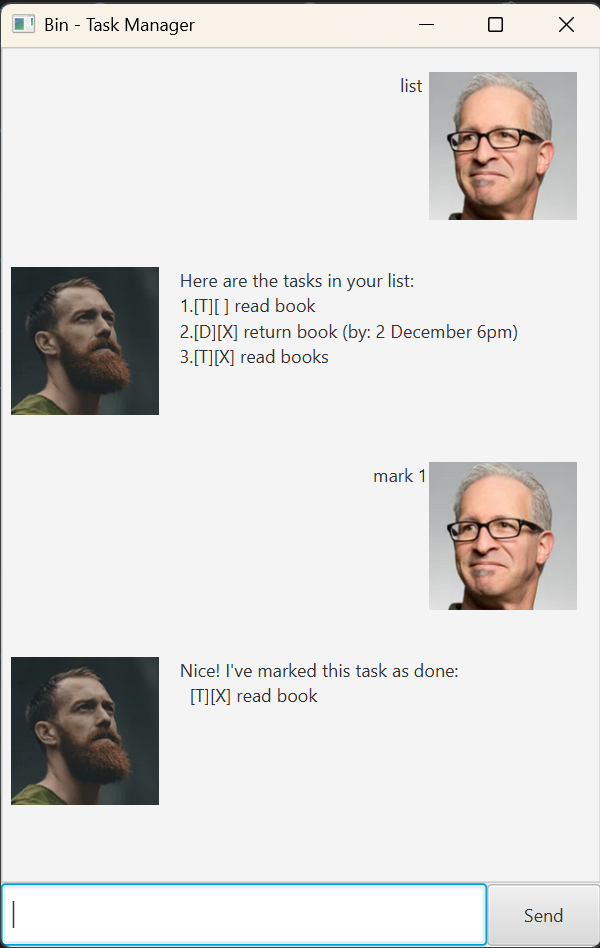

# Bin User Guide
A snippet of **Bin GUI**


## Introduction
**Bin** is a lightweight task management tool built with JavaFX that allows users to manage tasks through a GUI interface.
It supports adding, marking, unmarking, deleting, and searching tasks — with both basic and advanced task handling.

---

## Adding Todo
The `todo` command lets you add simple tasks that don't have a specific date or time 
— just something you need to get done.

Example: `todo read books`

Output:
```
    Got it. I've added this task:
      [T][ ] read books
    Now you have 3 tasks in the list.
```
---
## Adding Deadlines
Deadlines can be added through a `deadline` command. These tasks support date and time parsing and are tracked 
with a completion status.

Example: `deadline return book /by 06/6/2025 1300`

Output:
```
    Got it. I've added this task:
      [D][ ] Submit assignment (by: 20 September 11PM)
    Now you have 3 tasks in the list.
```
---
## Adding Events
The `event` command adds a task that spans a specific time period, such as a meeting or class. 
It includes both a start and end time.

Example: `event project meeting /from Mon 2pm /to 4pm`

Output:
```
    Got it. I've added this task:
      [E][ ] project meeting (from: Mon 2pm to: 4pm)
    Now you have 3 tasks in the list.
```
---
## Listing All Tasks
You can view all tasks currently in your task list using the `list` command.

Example: `list`

Output:
```
    Here are the tasks in your list:
     1.[T][ ] read book
     2.[D][X] return book (by: 6 June 1pm)
     3.[E][ ] project meeting (from: Aug 6th 2pm to: 4pm)
     4.[T][X] join sports club
     5.[T][ ] borrow book
```
---
## Marking Tasks as Done

Use the `mark` command to mark a task as complete.

Example: `mark 1`

Output:
```
    Nice! I've marked this task as done:
      [T][X] read book
```
---
## Unmarking Tasks

Use the `unmark` command to set a task as incomplete.

Example: `unmark 1`

Output:
```
    OK, I've marked this task as not done yet:
      [T][ ] read book

```
---
## Deleting Tasks

Use the `delete` command followed by the task number to remove a task.

Example: `delete 1`

Output:
```
    Noted. I've removed this task:
      [T][ ] read book
    Now you have 4 tasks in the list.
```
---
## Searching for Tasks

Use the `find` command followed by a keyword to filter your tasks.

Example: `find book`

Output:
```
    Here are the matching tasks in your list:
     1.[T][X] read book
     2.[D][X] return book (by: 6 June 1pm)
     3.[T][ ] borrow book
```
---
## Prevent Duplicate Tasks

Bin automatically checks for duplicate tasks when adding a new one. 
If a duplicate is detected (same description and type), the task will not be added.

---
## Notes

- All inputs are case-sensitive.